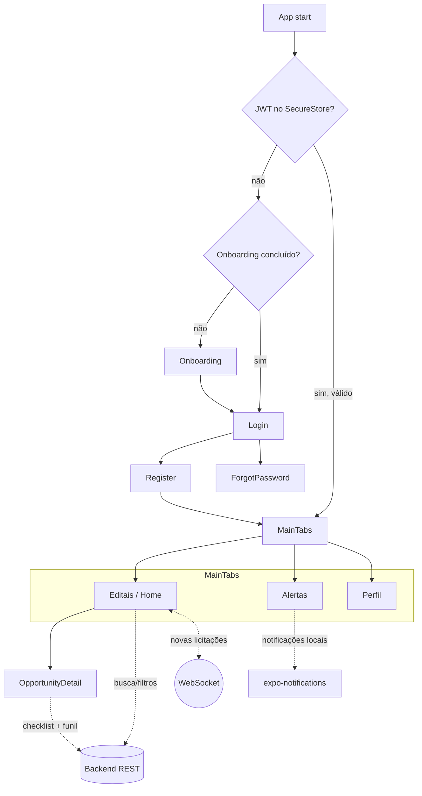

# Recife Mei — App Mobile


> **Licitações públicas ao alcance do MEI.** Centralize editais, entenda o "juridiquês" e nunca mais perca um prazo.


O **Recife Mei** é o aplicativo mobile (React Native + Expo) da Plataforma de Apoio à
Concorrência Pública para Microempreendedores Individuais (MEIs). Ele reúne em um só
lugar a descoberta de oportunidades de compras públicas, a tradução dos requisitos
legais em linguagem simples, um checklist interativo de habilitação, alertas de prazo
com notificações locais e um painel de acompanhamento da participação do usuário. O
foco é *mobile-first*, com fluxos diretos, acessíveis e construídos sobre os incentivos
previstos na **Lei nº 14.133/2021** (Nova Lei de Licitações e Contratos Administrativos).

---

## 1. Proposta e negócio

### O problema
Microempreendedores Individuais enfrentam barreiras severas para participar das compras
públicas, mesmo com os incentivos da Lei 14.133/2021. As dores centrais são:

1. **Assimetria de informação** — oportunidades e editais ficam espalhados em portais
   governamentais fragmentados, difíceis de localizar e filtrar por nicho de atuação.
2. **Barreira linguística e burocrática** — os requisitos jurídicos e técnicos dos
   editais são escritos em "juridiquês", inacessíveis para a maioria dos MEIs.
3. **Gestão operacional deficiente** — falta de ferramentas acessíveis para organizar
   documentos habilitatórios, controlar prazos e acompanhar fases de uma licitação.

### Público-alvo
Microempreendedores Individuais (MEIs) e microempresas que querem (ou precisam) competir
por contratos públicos, mas não dispõem de estrutura jurídica/administrativa para isso.

### Proposta de valor
Democratizar, simplificar e desmistificar a participação de MEIs em licitações públicas.
O app centraliza, traduz e ajuda a gerenciar o ciclo de vida de uma oportunidade através
de uma interface mobile intuitiva:

- **Centraliza** editais e oportunidades em uma lista única com busca e filtros.
- **Pontua a aderência** de cada oportunidade ao perfil do MEI (CNAE/CNPJ) com um *score
  de compatibilidade*.
- **Traduz** os requisitos do edital em linguagem simples (resumo + requisitos +
  documentos exigidos).
- **Organiza a ação** com um checklist interativo de habilitação e um funil de
  participação (preparando → enviada → ganha/perdida).
- **Avisa a tempo** com alertas de prazo e notificações locais agendadas.

> Base de produto detalhada em [`docs/project-context.md`](docs/project-context.md).

---

## 2. Principais funcionalidades

Organizadas pelos fluxos reais do app:

### Onboarding e autenticação
- Carrossel de introdução com os benefícios, exibido **apenas no primeiro acesso**
  (controlado pela flag `onboarding_completed` no armazenamento seguro).
- Cadastro com dados da empresa (nome, sobrenome, e-mail, **CNPJ** e **CNAE**), validado
  com Zod, incluindo política de senha (mín. 8 caracteres, maiúscula, minúscula e número).
- **Consentimento LGPD** obrigatório no cadastro: aceite explícito dos Termos de Uso e da
  Política de Privacidade (`acceptTerms`).
- Login por e-mail ou CNPJ.
- **Recuperação de senha** em duas etapas (solicitação por e-mail/CNPJ → redefinição com
  código/token).
- Sessão restaurada automaticamente na abertura do app e encerrada de forma segura.

### Lista e busca de editais (Editais)
- Listagem em *cards* dinâmicos das oportunidades de contratação.
- Busca por palavra-chave e **filtros avançados**: UF, município, modalidade, CNAE,
  faixa de valor (mín./máx.), status e modo "exclusivo ME/EPP".
- **Score de compatibilidade** (% de aderência) exibido por oportunidade quando disponível.
- Atualização em tempo real via **WebSocket** quando novas licitações chegam ao backend.

### Detalhe da oportunidade
- Dados do órgão, datas importantes (abertura/encerramento de proposta), valor estimado e
  status da oportunidade.
- **Resumo simplificado** e **requisitos** traduzidos em linguagem acessível, além da lista
  de **documentos exigidos**.
- Indicador de **elegibilidade** (exclusiva ME/EPP, dentro do limite do MEI) com mensagem.
- **Checklist interativo de habilitação** correlacionado às exigências, com progresso e
  itens obrigatórios.
- **Funil de participação**: marca a oportunidade como *preparando*, *enviada*, *ganha* ou
  *perdida* (sincronizado com o backend).
- Links oficiais para o processo no portal de origem.

### Alertas (Alertas)
- Lista de alertas de prazo classificados por tipo e prioridade (proposta crítica/em breve/
  segura, documento expirado, informativo) e status (aberto/lido/resolvido).
- Ações de **marcar como lido** e **resolver**.
- **Notificações locais** agendadas no dispositivo, por padrão alguns dias antes da data
  crítica, evitando duplicações ao reagendar.

### Perfil e dashboard (Perfil)
- Dados da conta e preferências de notificação.
- **Dashboard** com indicadores (saúde documental, documentos pendentes/expirados, alertas
  abertos, total de contratações).
- **Funil** consolidado e **histórico mensal** de participação.
- Edição de perfil e logout.

> Documentos: o serviço de documentos existe no app (resumo + listagem + edição), porém a
> aba **Documentos** está temporariamente desabilitada na navegação (ver
> [Limitações conhecidas](#10-limitações-conhecidas)).

---

## 3. Tecnologias e stack

| Tecnologia | Versão | Uso no projeto |
|---|---|---|
| [Expo](https://expo.dev) | `~54.0.33` | Tooling, build e runtime multiplataforma (iOS, Android, Web) |
| [React Native](https://reactnative.dev) | `0.81.5` | Framework mobile (com New Architecture habilitada) |
| [React](https://react.dev) | `19.1.0` | Biblioteca base de UI (React Compiler habilitado) |
| [TypeScript](https://www.typescriptlang.org) | `~5.9.2` | Tipagem estática em todo o código |
| [React Navigation](https://reactnavigation.org) | `~7.x` | Navegação: native-stack + bottom-tabs |
| [NativeWind](https://www.nativewind.dev) + [Tailwind CSS](https://tailwindcss.com) | `^4.2.3` / `^3.4.19` | Estilização utilitária |
| [Zod](https://zod.dev) | `^4.4.3` | Validação de formulários (login, cadastro, recuperação de senha) |
| [expo-secure-store](https://docs.expo.dev/versions/latest/sdk/securestore/) | `~15.0.8` | Armazenamento seguro de JWT e flags (com fallback p/ `localStorage` na web) |
| [expo-notifications](https://docs.expo.dev/versions/latest/sdk/notifications/) | `^0.32.17` | Notificações **locais** de prazo |
| WebSocket (API nativa) | — | Streaming de novas licitações em tempo real |
| [expo-haptics](https://docs.expo.dev/versions/latest/sdk/haptics/) | `~15.0.8` | Feedback tátil |
| [react-native-reanimated](https://docs.swmansion.com/react-native-reanimated/) | `~4.1.1` | Animações e transições |
| [@expo/vector-icons](https://icons.expo.fyi) (Ionicons) | `^15.0.3` | Ícones |

> O `expo-router` está presente nas dependências, mas **não** é usado para as telas: a
> navegação real é feita via React Navigation.

---

## 4. Arquitetura do app

O app segue uma separação clara por responsabilidade dentro de `src/`:

- **`navigation/`** — define a navegação. O `AppNavigator` (native-stack) decide o fluxo de
  acordo com a sessão: usuário não autenticado vê Onboarding/Login/Register/ForgotPassword;
  autenticado entra no `MainTabNavigator` (abas Editais, Alertas, Perfil) e na pilha está
  também o detalhe de oportunidade.
- **`screens/`** — telas de cada fluxo (Onboarding, Login, Register, ForgotPassword, Home,
  OpportunityDetail, Alerts, Documents, Profile).
- **`services/`** — camada de acesso à API REST (`api`, `auth`, `contratacoes`, `alerts`,
  `documents`). Tudo passa por um `apiRequest` central com timeout, tratamento de erros
  (`ApiError`) e *handler* global de 401 que limpa a sessão.
- **`store/`** — estado global via Context: `AuthContext` (sessão/usuário/JWT),
  `StreamingContext` (WebSocket de licitações) e `authStorage` (persistência segura).
- **`config/`** — resolução das URLs de backend e streaming a partir das variáveis de
  ambiente, com *defaults* públicos.
- **`hooks/`**, **`components/`**, **`theme/`**, **`utils/`**, **`validation/`**,
  **`types/`** — utilitários e blocos de UI reutilizáveis.

### Conexão com o backend e streaming
- **API REST:** `EXPO_PUBLIC_API_URL` (default público:
  `https://api-projeto-integrador-hcu8.onrender.com`). Todas as chamadas usam esse host.
- **Streaming em tempo real:** `EXPO_PUBLIC_STREAMING_WS_URL` (default público:
  `wss://cesar-engenharia-de-dados.onrender.com/ws/notificacoes`). O hook
  `useLicitacoesStreaming` mantém um WebSocket com reconexão automática.

### Sessão segura
O JWT é obtido no login/cadastro e persistido com **expo-secure-store** (no nativo) ou
`localStorage` (na web). Na abertura, a sessão é restaurada validando o token em `/me`.
Respostas `401` disparam logout automático.



---

## 5. Estrutura de pastas

```
front-projeto-integrador/
├── App.tsx                  # Providers (SafeArea, Auth, Streaming) + NavigationContainer
├── index.ts                 # registerRootComponent
├── app.json                 # Configuração Expo (plugins, ícones, scheme)
├── .env.example             # Modelo das variáveis EXPO_PUBLIC_*
└── src/
    ├── navigation/          # AppNavigator (stack) + MainTabNavigator (tabs)
    ├── screens/             # Telas de cada fluxo (Onboarding, Login, Home, ...)
    ├── services/            # Cliente REST: api, auth, contratacoes, alerts, documents
    ├── store/               # Context: AuthContext, StreamingContext, authStorage
    ├── config/              # api.ts e streaming.ts (URLs via env + defaults)
    ├── hooks/               # useLicitacoesStreaming (WebSocket)
    ├── components/          # UI reutilizável (auth, home, botões, onboarding)
    ├── validation/          # Schemas Zod (auth)
    ├── utils/               # notifications, motion, helpers
    ├── theme/               # colors, spacing, typography
    ├── types/               # Tipos de navegação
    └── assets/              # Imagens (logo, onboarding)
```

---

## 6. Como rodar

### Pré-requisitos
- **Node.js** 18+ (recomendado LTS).
- **npm** — o gerenciador de pacotes padrão do projeto. (O repositório contém artefatos do
  Yarn PnP, mas a documentação e os scripts assumem npm.)
- App **Expo Go** no celular (Android/iOS) ou um emulador/simulador, para testar no
  dispositivo.

### Instalação
```bash
npm install
```

### Variáveis de ambiente
```bash
cp .env.example .env
```
Por padrão, mesmo **sem** `.env` o app aponta para a **API pública** e o **streaming
público** (defaults em `src/config/`). Para usar um backend local, edite `EXPO_PUBLIC_API_URL`.

### Iniciar
```bash
npx expo start
```
No menu do Expo CLI você pode:
- escanear o QR Code com o **Expo Go** (Android/iOS);
- pressionar `w` para abrir na **web**;
- pressionar `a` / `i` para emulador Android / simulador iOS.

Scripts disponíveis (`package.json`): `npm start`, `npm run android`, `npm run ios`,
`npm run web`, `npm run lint`.

---

## 7. Variáveis de ambiente

Todas usam o prefixo `EXPO_PUBLIC_` para serem expostas ao cliente em tempo de build.

| Variável | Descrição | Default |
|---|---|---|
| `EXPO_PUBLIC_API_URL` | URL base da API REST do backend | `https://api-projeto-integrador-hcu8.onrender.com` |
| `EXPO_PUBLIC_STREAMING_WS_URL` | URL do WebSocket de novas licitações | `wss://cesar-engenharia-de-dados.onrender.com/ws/notificacoes` |

> O arquivo `.env.example` aponta `EXPO_PUBLIC_API_URL` para `http://localhost:3000`
> (cenário de desenvolvimento com backend local). Os *defaults* de código apontam para os
> serviços públicos.

---

## 8. Documentação relacionada

- [`docs/project-context.md`](docs/project-context.md) — proposta de produto, negócio e escopo do MVP.
- [`docs/APP-GUIA-DE-USO.md`](docs/APP-GUIA-DE-USO.md) — guia didático do app, tela a tela e jornadas ponta a ponta.
- [`docs/HISTORIAS-DE-USUARIO.md`](docs/HISTORIAS-DE-USUARIO.md) — histórias de usuário e status de implementação.
- [`IMPLEMENTACAO.md`](IMPLEMENTACAO.md) — detalhes técnicos da entrega: gaps resolvidos, arquivos afetados e como integrar com a API.

---

## 9. Limitações conhecidas

- **Notificações locais, não push remoto.** Os alertas de prazo são agendados localmente no
  dispositivo via `expo-notifications`. Não há push notifications remotas (servidor → device).
- **Sem notificações na web.** As funções de notificação são *no-op* quando `Platform.OS === 'web'`.
- **Tradução por glossário/regras, sem IA.** O "resumo simplificado" e a tradução de
  requisitos do edital vêm de regras/glossário no backend — não há modelo de IA integrado.
- **Aba Documentos desabilitada.** O fluxo de documentos está implementado nos serviços, mas
  a aba foi ocultada na navegação por decisão de produto; o envio/criação de documentos pelo
  app também está desativado.
- **`expo-router` não utilizado.** Está nas dependências, mas a navegação real é via React
  Navigation.
- **Dependência dos serviços públicos.** Sem configurar `.env`, o app usa backends hospedados
  (Render), que podem ter *cold start* e indisponibilidade ocasional.

---

## 10. Entrega final da disciplina

Para a avaliação, foi gerado um **APK Android instalável** do reekinator a partir do EAS
Build (perfil `preview`). Não é necessário ter o ambiente de desenvolvimento configurado
para testar: basta baixar e instalar o APK em um dispositivo Android.

### Onde obter o APK
- **Release do GitHub:** [henryzera/front-projeto-integrador — releases](https://github.com/henryzera/front-projeto-integrador/releases/latest)
- **Build do Expo (EAS):** [expo.dev — builds do projeto](https://expo.dev/accounts/henryzera/projects/front-projeto-integrador/builds)

### Como instalar no Android
1. Abra um dos links acima no celular e baixe o arquivo `.apk` mais recente.
2. Toque no arquivo baixado para instalar. Se solicitado, **permita a instalação de apps de
   fontes desconhecidas** (Configurações → Apps → Acesso especial → Instalar apps desconhecidos).
3. Abra o **reekinator** normalmente. Por padrão, o app já aponta para os serviços públicos
   (API e streaming), então funciona sem configuração adicional.

> O APK é destinado a avaliação/testes (distribuição interna), não a publicação na Play Store.
