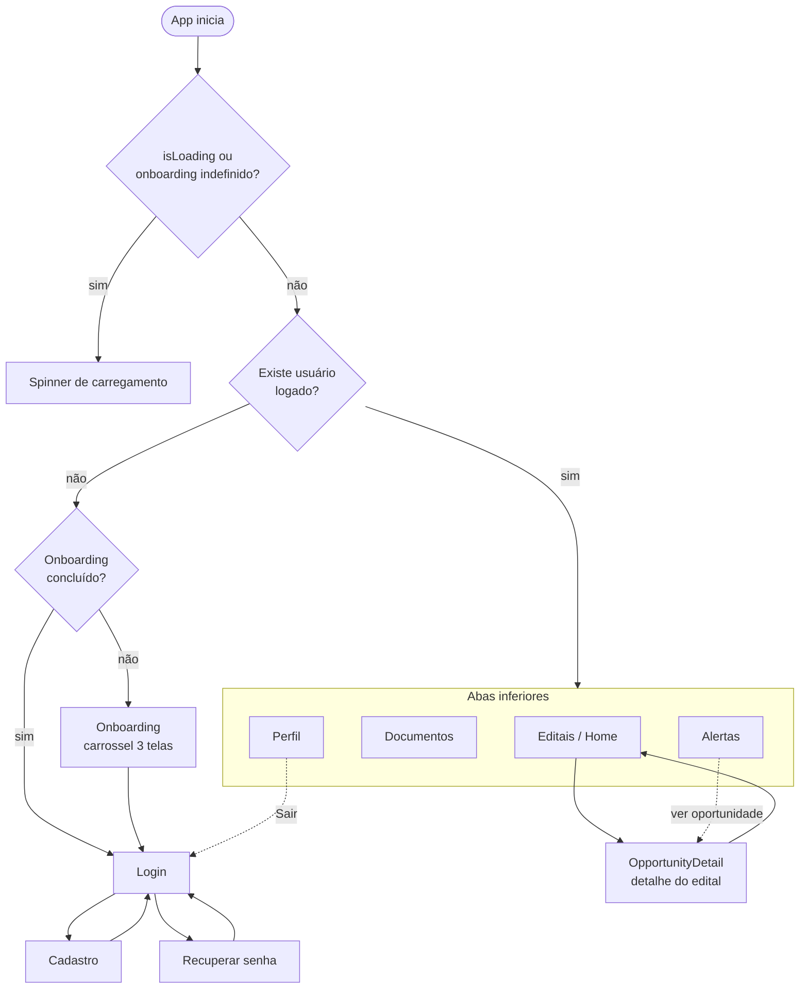

# Guia de Uso do Aplicativo — Projeto Integrador (reekinator)

> Documento didático que descreve o aplicativo mobile, sua arquitetura de navegação,
> cada tela, as jornadas de uso ponta a ponta e os recursos transversais.
> Escrito para que qualquer leitor (técnico ou não) entenda como o app funciona.

---

## 1. Visão geral do app

### Propósito
O aplicativo apoia **Microempreendedores Individuais (MEIs)** e microempresas a participarem de
**licitações públicas** (compras governamentais), amparados pela **Lei nº 14.133/2021**. Ele resolve três
dores principais (ver `docs/project-context.md`):

1. **Achar oportunidades** — centraliza editais que hoje ficam espalhados em portais governamentais.
2. **Entender o "juridiquês"** — traduz/resume requisitos do edital em linguagem simples.
3. **Não perder prazos nem documentos** — checklist de habilitação, alertas de prazo e repositório
   educativo de documentos.

A fonte de dados é o **PNCP (Portal Nacional de Contratações Públicas)**, alimentado por um pipeline de
dados (ETL) e exposto por um backend próprio.

### Stack técnica
- **React Native + Expo** (app multiplataforma iOS/Android/Web).
- **TypeScript** em todo o código (`src/`).
- **React Navigation** — pilha nativa (`@react-navigation/native-stack`) + abas inferiores
  (`@react-navigation/bottom-tabs`).
- **Zod** para validação de formulários (`src/validation/auth.ts`).
- **expo-secure-store** para guardar o token de sessão com segurança.
- **expo-notifications** para notificações locais de prazo.
- **WebSocket** nativo para o streaming de novas licitações.

### Como se conecta ao backend
- A URL base da API é configurável por variável de ambiente, com um valor público padrão
  (`src/config/api.ts`):
  - `EXPO_PUBLIC_API_URL` ou, na ausência dela, `https://api-projeto-integrador-hcu8.onrender.com`.
- Toda chamada passa por um cliente central (`src/services/api.ts`, função `apiRequest`):
  - injeta `Authorization: Bearer <token>` quando há sessão;
  - tem **timeout de 20s** (devolve erro 408 amigável);
  - em respostas **401** dispara um handler que **limpa a sessão local** automaticamente
    (logout forçado — ver `setUnauthorizedHandler` em `AuthContext`).

### Como se conecta ao streaming (tempo real)
- A URL do WebSocket também é configurável (`src/config/streaming.ts`):
  - `EXPO_PUBLIC_STREAMING_WS_URL` ou padrão
    `wss://cesar-engenharia-de-dados.onrender.com/ws/notificacoes`.
- O hook `useLicitacoesStreaming` (`src/hooks/useLicitacoesStreaming.ts`) mantém a conexão,
  **reconecta a cada 5s** quando cai, e só fica ativo quando há usuário logado
  (`StreamingProvider` liga/desliga conforme o token — `src/store/StreamingContext.tsx`).
- Novos editais recebidos aparecem em tempo real na tela de Editais e na de Alertas.

### Hierarquia de providers (`App.tsx`)
```
SafeAreaProvider
  └─ AuthProvider           (sessão/usuário)
       └─ StreamingProvider (WebSocket; ativo só com token)
            └─ NavigationContainer
                 └─ AppNavigator
```

---

## 2. Mapa de navegação

A raiz é uma **pilha** (`src/navigation/index.tsx`) que decide o fluxo conforme dois estados:
- **`user`** (há sessão? — vem do `AuthContext`);
- **`onboardingCompleted`** (flag persistida — `getOnboardingCompleted`).

Enquanto esses estados são resolvidos, exibe-se um **spinner de carregamento** em tela cheia.

- **Sem usuário e onboarding NÃO concluído:** Onboarding → Login → Register → ForgotPassword.
- **Sem usuário e onboarding concluído:** a tela de Onboarding é removida da pilha; entra direto em Login.
- **Com usuário:** `MainTabs` (abas) + `OpportunityDetail` (empilhada sobre as abas).

As abas (`src/navigation/MainTabNavigator.tsx`) iniciam em **Editais** e são quatro:
**Editais, Documentos, Alertas, Perfil**.



Tipos de rota: `src/types/navigation.ts`
- `RootStackParamList`: `Onboarding`, `Login`, `Register`, `ForgotPassword`, `MainTabs`,
  `OpportunityDetail { id: string }`.
- `MainTabParamList`: `Editais`, `Documentos`, `Alertas`, `Perfil`.

---

## 3. Por tela: o que existe e como o usuário usa

### 3.1 Onboarding (`src/screens/OnboardingScreen.tsx`)
- **Objetivo:** apresentar a proposta de valor em um carrossel de 3 slides.
- **UI:** `FlatList` horizontal com paginação, `PaginationDots` e botão **Continuar**.
- **Slides:** (1) "Licitações na palma da sua mão"; (2) "Chega de editais complicados"
  (linguagem simples da Lei 14.133/2021); (3) "Prazos sob controle" (documentos + alertas).
- **Ações:** "Continuar" avança o slide; no último slide, **conclui o onboarding**
  (`setOnboardingCompleted(true)`) e navega para **Login**.
- **Dados/endpoint:** nenhum (conteúdo estático).
- **Estados:** sem loading/erro de rede; mesmo que a persistência falhe, segue para o Login para não travar o usuário.

### 3.2 Login (`src/screens/LoginScreen.tsx`)
- **Objetivo:** autenticar com **email OU CNPJ** + senha.
- **UI:** logo, título, dois campos (`AuthTextInput`), botão **Entrar**, link "Esqueci minha senha",
  link "Cadastre-se".
- **Ações:** validação local com `loginFormSchema` (identificador ≥ 3 chars, senha obrigatória) →
  `signIn` → `POST /auth/login`.
- **Dados/endpoint:** `POST /auth/login` (`src/services/auth.ts`). Sucesso grava token + usuário e troca
  automaticamente para as abas.
- **Estados:** `isSubmitting` (botão em loading); erros de validação (Zod) e de API (`ApiError`) exibidos
  como texto vermelho.

### 3.3 Cadastro (`src/screens/RegisterScreen.tsx`)
- **Objetivo:** criar conta em **3 passos**.
- **UI/passos:**
  - **Passo 1 — dados pessoais:** email, nome, sobrenome.
  - **Passo 2 — empresa:** CNPJ, CNAE (teclado numérico).
  - **Passo 3 — senha:** senha + confirmação.
  - Indicador "Passo X de 3", botões **Próximo/Cadastrar**, **Voltar** e link **Entrar**.
- **Ações:** validações leves por passo; no envio, `registerFormSchema` valida
  (CNPJ 14 dígitos, CNAE 7 dígitos, email válido, senha forte: ≥8, maiúscula, minúscula e número,
  confirmação igual) → `signUp` → `POST /auth/register`.
- **Dados/endpoint:** `POST /auth/register`. Sucesso já loga o usuário (aplica sessão) e entra nas abas.
- **Estados:** `isSubmitting`; mensagens de erro de validação e de API.

### 3.4 Recuperar senha (`src/screens/ForgotPasswordScreen.tsx`)
- **Objetivo:** redefinir a senha em **2 etapas** (solicitar → redefinir).
- **UI:**
  - **Etapa `request`:** campo email/CNPJ + **Enviar instruções**.
  - **Etapa `reset`:** código de recuperação, nova senha, confirmação + **Redefinir senha**.
- **Ações/endpoints:**
  - `POST /auth/forgot-password` (`requestPasswordReset`). Em **modo desenvolvimento** o backend pode
    devolver `resetToken`, que é **preenchido automaticamente** no campo (com aviso e validade em minutos).
  - `POST /auth/reset-password` (`resetPassword`). Sucesso mostra alerta e volta ao **Login**.
- **Estados:** `isSubmitting`; mensagens informativas (`infoMessage`) e de erro.

### 3.5 Editais / Home (`src/screens/HomeScreen.tsx`)
- **Objetivo:** descobrir, buscar e filtrar oportunidades; ver score de compatibilidade.
- **UI principal:**
  - **Hero:** "Encontramos N oportunidades para o seu perfil".
  - **Busca** (`HomeSearchBar`) por objeto/cidade.
  - **Botão Filtros** com badge da quantidade de filtros ativos + "Limpar filtros".
  - **Indicador de streaming** ("Streaming PNCP conectado" / "Reconectando").
  - **Aviso `StreamingNotice`** quando chega um novo edital em tempo real.
  - **Grade de 2 colunas** de `OpportunityCard` (variantes `compact`/`media`); `RefreshControl` para puxar e atualizar.
- **Filtros (`HomeFilterPanel`, modal de baixo):** município, UF, modalidade
  (Pregão Eletrônico, Dispensa Eletrônica, Concorrência), faixa de valor
  (até R$ 50 mil, R$ 50–150 mil, acima de R$ 150 mil), toggle **Oportunidades MEI** (`meOnly`)
  e toggle **Compatível com meu CNAE** (desabilitado se o usuário não tem CNAE). Filtros são **combináveis**.
- **Dados/endpoint:** `GET /contratacoes` (`listContratacoes`) com query montada a partir de
  busca + filtros (`q`, `municipio`, `uf`, `modalidadeNome`, `valorMin`, `valorMax`, `meOnly`, `cnae`,
  `limit=12`, `skip=0`). A busca/filtros são aplicados com **debounce de 350ms**.
- **Score de compatibilidade:** cada card mostra o `compatibilityScore` vindo da API, classificado em
  **Alta (≥80) / Média (≥60) / Baixa (<60)**; quando não há score, mostra "Sem score" (estado neutro).
- **Tempo real:** ao chegar um `novaLicitacao` pelo WebSocket, o item é inserido no topo (com animação),
  o contador é incrementado e um aviso temporário aparece por ~4,5s.
- **Estados:** loading (spinner na primeira carga / `RefreshControl`), erro
  ("Nao foi possivel carregar as licitacoes agora.") e vazio
  ("Nenhum edital encontrado para os filtros selecionados.").

### 3.6 Detalhe do edital (`src/screens/OpportunityDetailScreen.tsx`)
- **Objetivo:** entender o edital e organizar a participação (checklist + funil).
- **UI por seção:**
  - **Cabeçalho** com voltar e título "Detalhe do edital".
  - **Resumo:** badge de % de aderência (ou "Sem score"), objeto, e aviso de que o score é só indicativo.
  - **Elegibilidade:** card verde/laranja conforme `dentroLimiteMei`, com mensagem e tag
    "Exclusiva para ME/EPP" quando aplicável.
  - **Entenda este edital:** lista em linguagem simples (`resumoSimplificado`).
  - **Grade de informações:** valor estimado, prazo, órgão, local, modalidade, situação.
  - **Cronograma:** abertura, encerramento, publicação no PNCP e última atualização.
  - **Requisitos:** lista de condições de participação.
  - **Status da participação (funil):** 4 opções — Em preparação / Enviada / Ganha / Perdida.
  - **Checklist de habilitação:** itens marcáveis com barra de progresso (X de Y, %), marca de
    obrigatório/opcional e salvamento automático por item.
  - **Portal oficial:** botões que abrem links oficiais via `Linking` (com deduplicação de URLs).
- **Dados/endpoints:**
  - `GET /contratacoes/:id` (`getContratacao`) — detalhe enriquecido.
  - `GET /contratacoes/:id/checklist` (`getContratacaoChecklist`).
  - **Marcar item do checklist → `PUT /contratacoes/:id/checklist`** com
    `{ items: [{ id, checked }] }` (`updateContratacaoChecklist`).
  - **Mudar status do funil → `PUT /contratacoes/:id/checklist`** com `{ participationStatus }`.
- **Interações importantes:**
  - **Atualização otimista:** o item/funil muda na hora na UI; se a API falhar, **reverte** ao estado anterior e mostra erro.
  - Spinner por item enquanto salva (`savingItemIds`); funil bloqueado durante o save.
- **Estados:** loading do detalhe e do checklist (separados), erros próprios para cada um, e estados
  vazios ("Nenhum item de checklist disponivel..." / "Link oficial nao informado...").

### 3.7 Alertas (`src/screens/AlertsScreen.tsx`)
- **Objetivo:** acompanhar prazos e eventos; receber lembretes locais.
- **UI:** segmentação **Lista / Calendário**; indicador de streaming; aviso de novo edital em tempo real.
  - **Lista:** eventos ordenados por prioridade e data; filtro alternável "todos / só os que pedem ação"
    (prioridade ≤ 2). Cada item tem cor/rótulo por tipo (Urgente, Em breve, No prazo, Vencido, Informativo).
  - **Calendário:** grade mensal com marcação por dia conforme a maior prioridade do dia; painel do dia
    selecionado lista os eventos.
- **Tipos de alerta (`AlertKind`):** `proposalCritical`, `proposalSoon`, `proposalSafe`,
  `documentExpired`, `info`.
- **Dados/endpoints:**
  - `GET /alerts?from&to&view` (`listAlerts`) — recarrega ao trocar mês ou aba.
  - **Tocar num alerta aberto → `PATCH /alerts/:id/read`** (`markAlertAsRead`).
  - **Resolver → `PATCH /alerts/:id/resolve`** (`resolveAlert`).
  - Diálogo do alerta oferece "Ver oportunidade" (navega a `OpportunityDetail`) quando há
    `relatedType === 'contratacao'`.
- **Tempo real:** novas licitações do WebSocket viram alertas locais "Nova oportunidade MEI/EPP"
  (id prefixado `stream-`), tratados localmente (read/resolve sem chamar a API).
- **Notificações locais:** ao carregar alertas, pede permissão **uma vez por sessão** e agenda lembretes
  apenas para alertas acionáveis (ver seção 5).
- **Estados:** loading, erro ("Nao foi possivel carregar seus alertas agora.") e vazio por período/dia.

### 3.8 Documentos (`src/screens/DocumentsScreen.tsx`)
- **Objetivo:** organizar documentos de habilitação como um **checklist educativo** (não substitui certidões oficiais).
- **UI:** barra de **saúde** ("% dos documentos estão em dia", animada), botão **+ Item**, nota educativa,
  resumo (categorias / pedem ação), grupos colapsáveis por categoria, e cada documento com badge de status.
- **Status do documento:** Pendente (Enviar), Em dia, Atenção, Vencido.
- **Dados/endpoints:**
  - `GET /documents/summary` (`getDocumentsSummary`) + `GET /documents` (`listDocuments`), carregados em paralelo.
  - **Criar item → `POST /documents`** (`createDocument`) com nome, categoria e vencimento opcional.
  - **Atualizar status → `PATCH /documents/:id`** (`updateDocument`).
  - **Remover → `DELETE /documents/:id`** (`deleteDocument`), com confirmação.
  - Tocar num documento abre um menu de status + Remover (`Alert`).
- **Estados:** loading, erro ("Nao foi possivel carregar seus documentos agora."), vazio
  ("Nenhum documento cadastrado ainda.").

### 3.9 Perfil (`src/screens/ProfileScreen.tsx`)
- **Objetivo:** ver painel (métricas + funil + histórico), editar dados/preferências e sair.
- **UI:**
  - **Cartão de perfil:** iniciais, "Conta verificada", nome e email.
  - **Empresa:** CNPJ formatado e CNAE, com selo "MEI".
  - **Métricas:** editais, % docs em dia, alertas, pendências, vencidos.
  - **Funil de participações:** barras Em preparação / Enviadas / Ganhos / Perdidos + **Histórico por mês**.
  - **Conta:** "Dados da empresa", "Preferências de alerta" (abrem o modal de edição) e "Segurança"
    (mostra aviso sobre sessão protegida).
  - **Sair** (logout).
  - **Modal de edição:** nome, sobrenome, email, CNPJ, CNAE, "dias antes do prazo" e switches de
    preferências (Alertas de propostas, Checklist de documentos, Email, Push).
- **Dados/endpoints:**
  - `GET /me/dashboard` (`getMeDashboard`) — métricas, funil e histórico.
  - **Salvar perfil → `PATCH /me`** (`updateMe`), incluindo `notificationPreferences`.
  - **Sair → `POST /auth/logout`** + limpeza local (ver `AuthContext.signOut`).
- **Estados:** loading do dashboard (o perfil segue útil mesmo se os cards falharem); funil mostra
  estado de loading/vazio próprio.

---

## 4. Jornadas de uso ponta a ponta

### Jornada A — Primeiro acesso (onboarding → cadastro → login)
1. O usuário abre o app pela primeira vez; sem sessão e sem onboarding concluído, vê o **carrossel** (3 slides).
2. Toca "Continuar" até o fim; o app marca `onboarding_completed` e abre o **Login**.
3. Sem conta, toca **Cadastre-se** e preenche os 3 passos (dados pessoais → CNPJ/CNAE → senha forte).
4. Ao **Cadastrar**, o backend cria a conta (`POST /auth/register`), o token é salvo no SecureStore e o app
   entra direto nas **abas** (já logado).
5. Em acessos futuros, com onboarding concluído, o app abre direto no **Login**; após `POST /auth/login`,
   vai para as abas. Se já houver token salvo, o app restaura a sessão sozinho (`GET /me`).

### Jornada B — Descobrir e filtrar editais
1. Na aba **Editais**, o usuário lê o total de oportunidades e vê os cards.
2. Digita na **busca** (objeto/cidade); após ~350ms o app chama `GET /contratacoes?q=...`.
3. Abre **Filtros** e combina: UF/município, modalidade, faixa de valor, "Oportunidades MEI" e
   "Compatível com meu CNAE". Os filtros ativos aparecem no badge.
4. Cada card mostra a **compatibilidade** (Alta/Média/Baixa) com base no `compatibilityScore` da API.
5. Se chegar um edital novo pelo **streaming**, ele surge no topo com um aviso.

### Jornada C — Abrir edital, entender e trabalhar o funil/checklist
1. O usuário toca num card → `OpportunityDetail` carrega detalhe (`GET /contratacoes/:id`) e checklist
   (`GET /contratacoes/:id/checklist`).
2. Lê o **resumo simplificado**, **requisitos**, **cronograma** e o cartão de **elegibilidade**.
3. Define o **status no funil** (ex.: "Em preparação") → `PUT /contratacoes/:id/checklist`
   com `{ participationStatus }`.
4. **Marca itens do checklist** conforme reúne documentos → `PUT /contratacoes/:id/checklist`
   com `{ items: [{ id, checked }] }`; a barra de progresso atualiza. Mudanças são otimistas e
   revertem em caso de erro.
5. Abre o **portal oficial** para conferir o edital antes de participar.

### Jornada D — Acompanhar alertas e receber lembretes de prazo
1. Na aba **Alertas**, o usuário vê a **Lista** ou o **Calendário** dos prazos do mês (`GET /alerts`).
2. Filtra "só os que pedem ação" para focar em prazos críticos/próximos.
3. Toca num alerta: se aberto, é marcado como lido (`PATCH /alerts/:id/read`); pode "Ver oportunidade"
   ou "Resolver" (`PATCH /alerts/:id/resolve`).
4. Na primeira vez, o app pede permissão de notificação e **agenda lembretes locais** para os prazos
   acionáveis (por padrão 2 dias antes; se já passou, no próprio dia).

### Jornada E — Gerenciar documentos de habilitação
1. Na aba **Documentos**, o usuário vê a **saúde** dos documentos e os grupos por categoria.
2. Toca **+ Item** e cadastra um item (nome, categoria, vencimento opcional) → `POST /documents`.
3. Toca num item para mudar o **status** (`PATCH /documents/:id`) ou **remover** (`DELETE /documents/:id`).
4. A barra de saúde e os contadores refletem o progresso.

### Jornada F — Ver painel/perfil e recuperar senha
1. Na aba **Perfil**, o usuário acompanha métricas, **funil** e **histórico mensal** (`GET /me/dashboard`).
2. Abre o modal e atualiza dados e **preferências de alerta** → `PATCH /me`.
3. **Sair** chama `POST /auth/logout` e limpa a sessão local; volta ao Login.
4. Caso tenha esquecido a senha, em **Recuperar senha** solicita o código (`POST /auth/forgot-password`)
   e redefine (`POST /auth/reset-password`).

---

## 5. Recursos transversais

### Autenticação e sessão segura (`src/store/AuthContext.tsx`, `authStorage.ts`)
- O **token JWT** é guardado no **SecureStore** (em web, `localStorage` como fallback).
- Na inicialização, o app tenta **restaurar a sessão** (`GET /me`); se o token for inválido, limpa tudo.
- Respostas **401** da API acionam **logout automático** (`setUnauthorizedHandler` → `clearLocalSession`).
- `signOut` revoga o token no servidor (`POST /auth/logout`) e, mesmo se falhar, garante a limpeza local.

### Tempo real (`useLicitacoesStreaming`, `StreamingContext`)
- WebSocket único, ligado só quando há sessão; **reconecta a cada 5s** se cair.
- Faz **parse defensivo** dos eventos (ignora payload inválido) e expõe `isConnected`, `lastError`,
  `novaLicitacao` e `eventSequence` (este último evita processar o mesmo evento duas vezes).
- Consumido por **Editais** (insere card novo) e **Alertas** (cria alerta local).

### Notificações locais (`src/utils/notifications.ts`)
- Usa **expo-notifications** para **agendar lembretes locais** de prazo (não são push remotos).
- Permissão pedida **uma vez por sessão**; em **web é no-op**.
- Evita duplicação cancelando o agendamento anterior de mesmo id (prefixo `deadline-`); ignora datas
  passadas; por padrão avisa **2 dias antes** do prazo (ou no próprio dia, se já passou).

### Persistência do onboarding (`authStorage.ts`)
- A flag `onboarding_completed` é gravada após o carrossel; depois disso, a tela de Onboarding deixa de
  aparecer no fluxo não autenticado.

### Validação de formulários (`src/validation/auth.ts`)
- **Zod** valida login, cadastro e recuperação de senha (CNPJ 14 dígitos, CNAE 7 dígitos, senha forte etc.).

---

## 6. Limitações conhecidas

- **Notificações locais, não push remoto:** os lembretes de prazo são agendados no próprio aparelho
  (expo-notifications). Não há push do servidor; com o app desinstalado/limpo, os lembretes se perdem.
  Em **web** as notificações não funcionam.
- **Tradução por glossário/resumo, sem IA:** o "resumo simplificado" e a tradução de requisitos vêm
  prontos do backend (abordagem determinística), não há geração por IA no app (o app inclusive evita
  afirmar uso de IA nos textos de UI).
- **Score de compatibilidade dentro de um pool:** o `compatibilityScore` é relativo aos editais
  retornados/processados; serve como **indicação de prioridade de leitura**, não como garantia de
  elegibilidade — o próprio detalhe avisa para conferir o edital oficial.
- **Documentos são um checklist educativo:** não há upload/armazenamento de arquivos oficiais nem
  validação jurídica; o app deixa isso explícito na tela.
- **Paginação simples na Home:** a lista carrega `limit=12` com `skip=0` (sem rolagem infinita); o total
  exibido vem do `total` da API.
- **Alertas de streaming são locais:** alertas criados a partir do WebSocket (id `stream-...`) não são
  persistidos no backend; ações de ler/resolver sobre eles só valem na sessão atual.
- **Reset de senha em desenvolvimento:** o código pode vir preenchido automaticamente
  (`resetToken`) — comportamento de ambiente de desenvolvimento, não de produção.

---

### Apêndice — Mapa rápido de endpoints por tela

| Tela | Endpoints usados |
|------|------------------|
| Login | `POST /auth/login` |
| Cadastro | `POST /auth/register` |
| Recuperar senha | `POST /auth/forgot-password`, `POST /auth/reset-password` |
| Editais (Home) | `GET /contratacoes` (+ WebSocket de streaming) |
| Detalhe do edital | `GET /contratacoes/:id`, `GET /contratacoes/:id/checklist`, `PUT /contratacoes/:id/checklist` |
| Alertas | `GET /alerts`, `PATCH /alerts/:id/read`, `PATCH /alerts/:id/resolve` (+ streaming) |
| Documentos | `GET /documents/summary`, `GET /documents`, `POST /documents`, `PATCH /documents/:id`, `DELETE /documents/:id` |
| Perfil | `GET /me/dashboard`, `PATCH /me`, `POST /auth/logout` |
| Sessão (transversal) | `GET /me` (restauração de sessão) |
